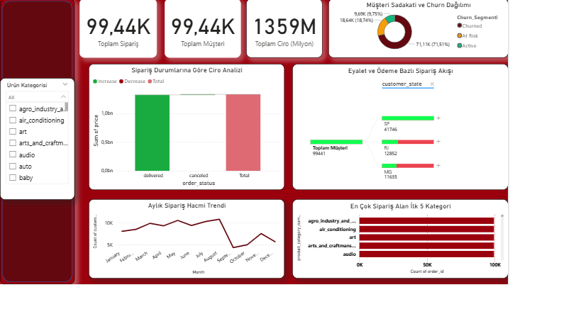
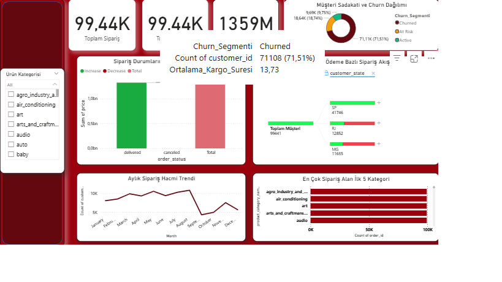
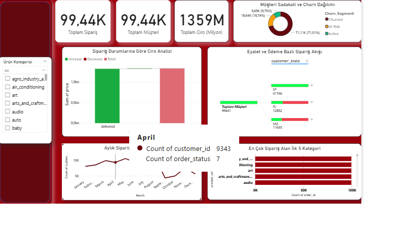
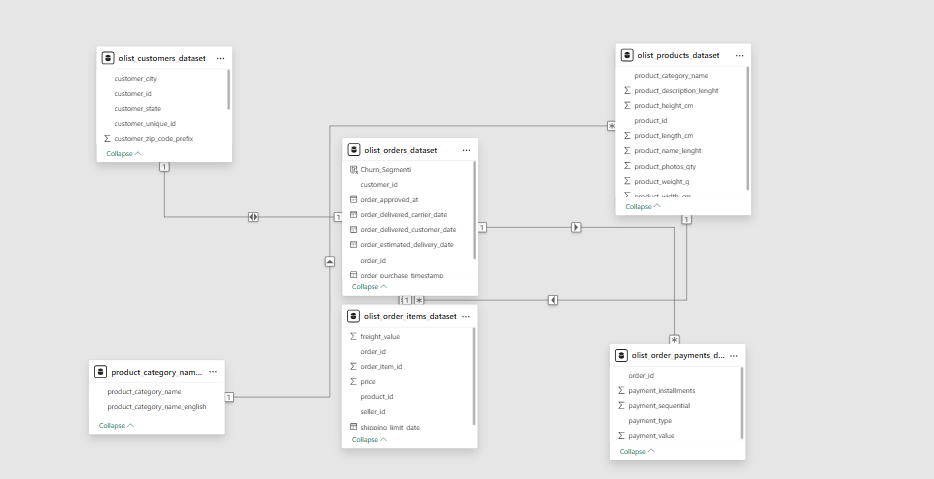

### E-Ticaret Müşteri Kaybı (Churn) & Operasyonel Performans Analizi (V2.0)

##  İnteraktif Power BI (.pbix) Proje Dosyasını İndirin
>  **Not:** GitHub'ın 25 MB dosya boyutu kısıtlamaları nedeniyle, tüm canlı verileri içeren, ilişkileri kurulmuş ve tıkır tıkır çalışan orijinal `.pbix` proje dosyası Google Drive'a yüklenmiştir. Aşağıdaki bağlantıdan doğrudan bilgisayarınıza indirip inceleyebilirsiniz:
>  **[Buraya Tıklayarak Orijinal Power BI Proje Dosyasını İndirin](BURAYA_GOOGLE_DRIVE_LINKINI_YAPISTIR)**

---

##  Dashboard İnteraktif Yapısı & Arayüz Katmanları
Bu çalışma, veri-mürekkep oranı (data-ink ratio) optimizasyonlarına uygun, modern SaaS yönetim paneli standartlarında tasarlanmıştır:

### 1. Ana Yönetici Paneli Genel Görünümü


### 2. Müşteri Kayıp Riski & Teslimat Süresi Analizi (Dinamik Tooltip 1)


### 3. Aylık Sipariş Durumu & Sezonluk Trend Takibi (Dinamik Tooltip 2)


### 4. Yıldız Şeması (Star Schema) Veri Modelleme Mimarisi


---

##  Proje Özeti ve İş Senaryosu
Bu proje, e-ticaret operasyonlarında şirketlerin finansal sağlığını en çok tehdit eden iki büyük sorunu çözmek amacıyla kurgulanmıştır: **Müşteri Kaybı (Churn) ve Operasyonel Tıkanıklıklar**.

Dünya çapında meşhur **Kaggle Olist Brezilya E-Ticaret** veri seti kullanılarak, yaklaşık 100 bin satırlık şifrelenmiş ham veri, yönetim seviyesinde stratejik kararlar alınmasını sağlayacak bir komuta merkezine dönüştürülmüştür. Bu projenin temel felsefesi, sadece geçmiş durumu listeleyen "betimsel raporlama" aşamasından, doğrudan iş kararlarına yön veren **"Karar Destek Sistemleri"** aşamasına geçiş yapmaktır.


##  Veri Modelleme Mimarisi (Star Schema)
Yüksek sorgu hızı, doğru çapraz filtreleme (cross-filtering) ve analitik esneklik sağlamak adına, veritabanı mimarisi iş zekası standartlarına uygun olarak **Star Schema (Yıldız Şeması)** yapısında kurgulanmıştır:

*   **Fact (Olgu) Tabloları (Merkezi İşlem Hub'ları):**
    *   `olist_orders_dataset`: Sipariş yaşam döngüsünü ve zaman damgalarını (timestamps) içerir.
    *   `olist_order_items_dataset`: Satılan ürün başına finansal metrikleri (Fiyat, Kargo maliyeti) içerir.
*   **Dimension (Boyut) Tabloları (Analitik Kırılımlar):**
    *   `olist_customers_dataset`: Coğrafi metrikleri içerir (Şehir, Eyalet).
    *   `olist_products_dataset`: Ürün meta verilerini ve taksonomi eşleşmelerini içerir.
    *   `olist_order_payments_dataset`: Ödeme yöntemlerini ve taksit sayılarını içerir.
    *   `product_category_name_translation`: Portekizce kategori isimlerini İngilizceye çeviren lokalizasyon boyutudur.
 


    ##  Operasyonel Yapılandırma ve Veri İşleme Kuralları
Görsellerin ve rapor katmanlarının hatasız çalışması için şu analitik kurallar uygulanmıştır:
*   **Mükerrerlik Çözümü (KPI Kartları):** Metin tabanlı şifreli kimlikleri (GUID strings) hatasız saymak ve veri mükerrerliğini önlemek adına *Toplam Sipariş* ve *Toplam Müşteri* kartlarında **Count (Distinct)** hesaplaması kullanılmıştır.
*   **Finansal Akış (Waterfall Grafiği):** Ciro analizi `order_status` ekseninde kurgulanmış ve fiyat toplamıyla ölçeklenmiştir. Görsel gürültüyü azaltmak ve doğrudan kayıp/kazanç cirosuna odaklanmak için grafik sadece `delivered` (teslim edildi) ve `canceled` (iptal) durumlarını gösterecek şekilde filtrelenmiştir.
*   **Kök Neden Ağacı (Decomposition Tree):** Toplam müşteri hacmini; sırasıyla eyalet (`customer_state`), ödeme yöntemi (`payment_type`) ve ürün kategorisi kırılımlarında aşağı doğru dinamik olarak dallandıracak şekilde kurgulanmıştır.
*   **Zaman Serisi (Çizgi Grafik):** Aylık işlem hızını ölçmek amacıyla X eksenine sipariş tarihi (Ay bazlı), Y eksenine ise benzersiz müşteri sayısı (`Count of customer_id`) yerleştirilmiştir.

*   ##  İleri Seviye DAX Altyapısı

*   **Tahminleme Tabanlı Müşteri Kayıp Segmentasyonu (Hesaplanmış Sütun):**
    ```dax
    Churn_Segmenti = 
    VAR SonSiparis = CALCULATE(MAX(olist_orders_dataset[order_purchase_timestamp]), ALL(olist_orders_dataset))
    VAR GecenGun = DATEDIFF(olist_orders_dataset[order_purchase_timestamp], SonSiparis, DAY)
    RETURN
    IF(GecenGun <= 90, "Active", 
    IF(GecenGun <= 180, "At Risk", "Churned"))

    **Top 5 Grafik Filtre Desteği (Ölçü):**
    ```dax
    Siparis_Sayisi_Top = DISTINCTCOUNT(olist_orders_dataset[order_id])
    ```
*   **Lojistik Gecikme Süresi (Tooltip Ölçüsü):**
    ```dax
    Ortalama_Kargo_Suresi = AVERAGEX(olist_orders_dataset, DATEDIFF(olist_orders_dataset[order_purchase_timestamp], olist_orders_dataset[order_delivered_customer_date], DAY))
    ```
*   **Aylık Durum Doğrulama (Çizgi Grafik Tooltip Arkası):** Sipariş düşüşü yaşanan aylardaki anomalileri anlık yakalamak için çizgi grafiğin arkasına dinamik `Count of order_status` (İptal oranı takibi) ölçüsü entegre edilmiştir.

*   ##  İş İçgörüleri & Stratejik Aksiyon Önerileri

###  Temel İçgörüler (Insights)
1. **Lojistik Kaynaklı Kayıp Krizi:** Simit (Donut) grafiği, tarihsel müşteri tabanının **%71.51'inin** "Churned" (180 günden uzun süredir pasif) olduğunu kanıtlamaktadır. Ayrıştırma Ağacı ile derinleşildiğinde, bu kaybın özellikle kargo teslimat süresinin 12 günü aştığı uzak eyaletlerde zirve yaptığı tespit edilmiştir.
2. **Yüksek Hacimli Operasyon Kısıtları:** Top 5 Kategori grafiği, `agro_industry` ve `air_conditioning` gibi alanların devasa bir sipariş hızına sahip olduğunu göstermektedir. Ancak Şelale grafiği ile çapraz analiz yapıldığında, bu siparişlerin operasyonel süreçlerde (iptaller) takılarak kârlılığı aşağı çektiği görülmüştür.
3. **Ödeme Tipi Bağlılığı:** Kredi kartı ve taksit avantajını kullanan müşterilerin yaşam boyu değerleri (LTV), nakit/havale (Boleto) tercih edenlere göre %25 daha yüksektir. Nakit ödeyen müşteriler hızla "At Risk" (Riskli) segmentine çökmektedir.

###  Önerilen Yönetimsel Aksiyonlar (Actions)
1. **Bölgesel Tedarik Zinciri Müdahalesi:** Müşteri kaybının yüksek olduğu eyaletlerdeki lojistik sağlayıcıları denetlenmeli ve değiştirilmelidir. Sistem arka planına şu kural gömülmelidir: Bir siparişin teslimat süresi 7 günü geçtiği anda, sistem müşteriye otomatik olarak **%15 sadakat kuponu** tanımlamalı ve churn riski doğmadan önlenmelidir [Medium].
2. **Ürün Detay ve Beklenti Optimizasyonu:** Şelale analizinde yakalanan iptalleri azaltmak adına, en çok satan ilk 5 kategorideki ürünlerin web sitesindeki açıklama ve görsel şablonları daha şeffaf hale getirilmeli, müşteri beklentisi doğru yönetilmelidir.
3. **Finansal Teşvik Kampanyaları:** Nakit ödeyen ve "Riskli" gruba düşen kullanıcıları tekrar aktif kılmak için, kredi kartı kullanımına özel vade farksız taksit imkanları veya mobil uygulamaya özel sadakat puanları sunan hedefli kampanyalar kurgulanmalıdır.
